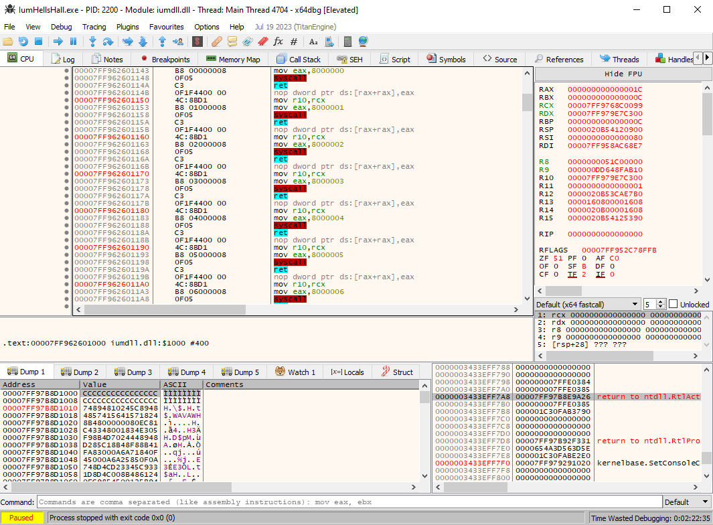

# IUM Syscalls

A PoC implementation presenting IUM runtime libraries as a viable source of syscall primitives.

## Overview

The `iumdll.dll` system library, typically associated with [Isolated User Mode (IUM)](https://learn.microsoft.com/en-us/windows/win32/procthread/isolated-user-mode--ium--processes) processes, contains numerous `syscall; ret` gadgets ideal for indirect syscall execution.

Its companion, `iumbase.dll`, exposes wrappers around the functions in `iumdll.dll` and lists it as an IAT dependency. To leverage this as a proxy loader, a custom import library `iumbase.lib` is provided for linking.



## Repository Structure

The repository layout is shown below:

```
.
├── assets/
├── include/
│   └── IumSyscalls.h
├── src/
│   ├── IumSyscalls.c
│   └── iumbase.def
├── scripts/
│   └── generate_lib.ps1
├── examples/
│   └── IumHellsHall/
│       └── IumHellsHall.sln
├── lib/
├── LICENSE
├── NOTICE
└── README.md
```

A few files are worth highlighting:

- `iumbase.def` – module definition file that declares the exports used to generate `iumbase.lib`.
- `generate_lib.ps1` – PowerShell script that invokes the linker to produce `iumbase.lib`
- `IumSyscalls.c` / `IumSyscalls.h` – minimal helper used to force IAT inclusion
- `IumHellsHall.sln` – Visual Studio example showing how the library can be used with Hell's Hall

> **Note:** `iumbase.lib` is generated under `lib/` as part of the build process and is not checked into the repository.

## Generating the Import Library

Open **Developer PowerShell for Visual Studio** and run `.\scripts\generate_lib.ps1`. 

```
PS C:\ium-syscalls> .\scripts\generate_lib.ps1

Created directory: C:\ium-syscalls\lib
Generating import library...
Architectur: X64
Microsoft (R) Library Manager Version 14.44.35217.0
Copyright (C) Microsoft Corporation. All rights reserved.

Creating library C:\ium-syscalls\lib\iumbase.lib and object C:\ium-syscalls\lib\iumbase.exp

Successfully generated:
C:\ium-syscalls\lib\iumbase.lib
```

## Integrating with Other C/C++ Projects

To integrate the library into a Visual Studio project, configure the following:

- Add `include\` to **C/C++ → Additional Include Directories**  
- Add `lib\` to **Linker → Additional Library Directories**  
- Add `iumbase.lib` to **Linker → Additional Dependencies**  
- Add `src\IumSyscalls.c` to the project  
- Include `IumSyscalls.h` in your source file  
- Call `AddIumdllToIAT()` before resolving syscalls

```
#include "IumSyscalls.h"

int main(void)
{
    AddIumdllToIAT();


    // syscall resolution logic


    return 0;
}
```

## IumHellsHall

A demo project is available at `examples/IumHellsHall/IumHellsHall.sln`.

**Build instructions:**

1. Generate `iumbase.lib`
2. Open the solution
3. Build using the x64 configuration

For each syscall, the SSN is resolved dynamically before execution is redirected to a stub in `iumdll.dll`, ultimately launching a calc payload.

```
PS C:\ium-syscalls> & ".\examples\IumHellsHall\x64\Release\IumHellsHall.exe"

[+] IUMDLL syscall : 0x00007FFDA6201198
[+] IUMDLL syscall : 0x00007FFDA6201168
[+] IUMDLL syscall : 0x00007FFDA6201158
[+] IUMDLL syscall : 0x00007FFDA6201148
[+] IUMDLL syscall : 0x00007FFDA6201178
[+] pTmpBuffer     : 0x00000288AE600000

[*] Press any key to decrypt...
```

## Acknowledgements

- [MaldevAcademy](https://maldevacademy.com) for [HellsHall](https://github.com/Maldev-Academy/HellHall) and [MaldevAcademyLdr.1](https://github.com/Maldev-Academy/MaldevAcademyLdr.1)  
- [Am0nSec](https://amonsec.net/) and RtlMateusz for [HellsGate](https://github.com/am0nsec/HellsGate)
- [Sektor7](https://institute.sektor7.net/) for [Halosgate](https://blog.sektor7.net/#!res/2021/halosgate.md)  
- [trickster0](https://trickster0.github.io/) for [TartarusGate](https://github.com/trickster0/TartarusGate) 

Portions of the example implementation are adapted from the projects above in accordance with their respective licenses.

## Requirements

- Windows 10 / 11 (x64)
- Visual Studio 2022 (MSVC toolchain)
- Developer PowerShell (for generating the import library)

## Disclaimer

Intended for research and educational purposes.

---
